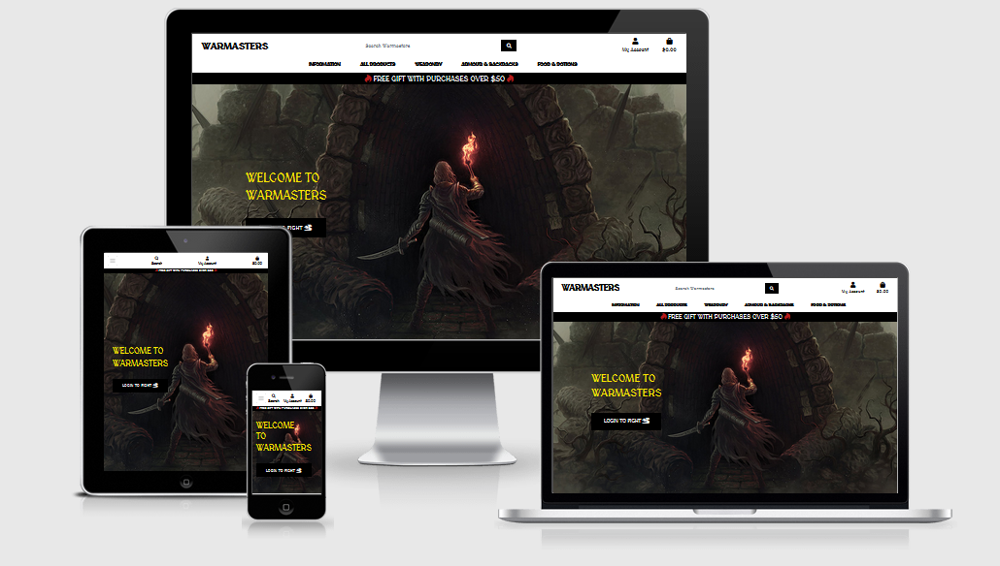

# WARMASTERS

[](https://warmasters.herokuapp.com/)

Warmasters (alpha-release) is the proof of concept to use Django to build a fantasy role playing game with a shop to purchase items for in-game use.

- [UX](#ux)
  - [Project Goal](#project-goal)
  - [User Stories](#user-stories)
    - [User Stories for Customers](#user-stories-for-customers)
    - [User Stories for Shop Administrators](#user-stories-for-shop-administrators)
  - [Wireframes](#wireframes)
  - [Data Structure](#data-structure)
  - [Design](#design)
    - [Typography](#typography)
    - [Colors](#colors)
- [Features](#features)
  - [Existing Features](#existing-features)
    - [Home Page](#home-page)
    - [Product Listing](#product-listing)
    - [Product View](#product-view)
    - [Producers Page](#producers-page)
    - [User Account](#user-account)
    - [Shopping Cart](#shopping-cart)
    - [Payment](#payment)
    - [Administrator features](#administrator-features)
  - [Features Left to implement](#features-left-to-implement)
- [Testing](#testing)
    -[Testing Webhooks](#testing-webhooks)
        -[ngrok method](#ngrok-method)
        -[Stripe CLI method](#stripe-cli-method)
- [Deployment](#deployment)
  - [Local Deployment](#local-deployment)
  - [Deployment to Heroku](#deployment-to-heroku)
- [Technologies](#technologies)
- [Tools Used](#tools-used)
- [Credits](#credits)
  - [Media](#media)
  - [Acknowledgements](#acknowledgements)

---

Welcome to Warmasters - the alpha testing for the shopfront and user profile, game profile, and storage of items. The game is in the development stage, with the proof of concept being released in this alpha version. Users will be able to login, create a profile, create a game profile, purchase items for up and coming missions and move items between storage, bags (for missions) and trade.

Access the site: <https://warmasters.herokuapp.com/>

[](https://warmasters.herokuapp.com/)

## UX

### Project Goal

This is the fourth and final Milestone Project in Code Institute's Fullstack Development program. The purpose of this project was to create an e-commerce site using the Django framework, static file hosting with AWS, and a functional payment system with Stripe. The e-commerce section of the site is fully functional, Stripe payments and webhooks are operational and all static files, including media (images) are located at Amazon Web Services (AWS). The site is ready for the second alpha phase, setting up the game play. This will still use Django's framework.

### User Stories

#### User Stories for Customers

A gamer would like to: | So the gamer can: | Page(s) associated:
--- | --- | ---
Browse for products to use in the game | Purchase products to use in game | https://warmasters.herokuapp.com/products/
Register using email or Google accounts | Easily access an account and receive an email to confirm registration | https://warmasters.herokuapp.com/accounts/social/signup/
Login to an account using email or Google (dependent on registration method) | Keep logged in permanently with a "remember me" checkbox | https://warmasters.herokuapp.com/accounts/login/
Search products | Choose products best suited for the game mission | https://warmasters.herokuapp.com/products/?q=sword
Filter products based on categories | Sort through items that are needed for a mission | https://warmasters.herokuapp.com/products/?q=sword&sort=price&direction=asc
Filter products by price | Game on a budget | https://warmasters.herokuapp.com/products/?sort=price&direction=asc
Filter products based on an admin rating | Choose products that will serve best in a mission | https://warmasters.herokuapp.com/products/?sort=rating&direction=asc
Sort products by their name | Find products based on a name | https://warmasters.herokuapp.com/products/?sort=rating&direction=asc
Read product descriptions | Get a better understanding of the purpose of the item | https://warmasters.herokuapp.com/products/33/
See special offers | Get a free gift with purchases over a set price | https://warmasters.herokuapp.com/
Buy a product for in game use and view in a shopping cart before purchase | Use the item during game play | https://warmasters.herokuapp.com/bag/
Update the number of items in the shopping cart before purchase | Purchase more items needed for game play | https://warmasters.herokuapp.com/bag/
Pay by using a credit card in from a safe and reputable source | Instantly purchase game items and have them delivered to the game profile | https://warmasters.herokuapp.com/checkout/
Buy a product and have the item delivered instantly to the game profile | Login to their account to have the item delivered to their storage | https://warmasters.herokuapp.com/game/game_item_storage/
Create a profile | Return and purchase items without needing to fill in details again | https://warmasters.herokuapp.com/profile/
Create a game profile | Use an in-game profile to have items delivered to instantly | https://warmasters.herokuapp.com/game/make_profile/
Create a character | Make a character to use during play based on one of four mythical characters |  https://warmasters.herokuapp.com/game/create_character/
Update profile information | Keep up to date data | https://warmasters.herokuapp.com/profile/
View previous purchases | See purchase history on the profile | https://warmasters.herokuapp.com/profile/
Receive an email confirming a purchase | Have a receipt and confirmation of purchase in an email | *Purchase an item and have the email sent
See items in storage, bag or trade locations | Use the items in an appropriate location | https://warmasters.herokuapp.com/game/game_item_bag/  https://warmasters.herokuapp.com/game/game_item_storage/  https://warmasters.herokuapp.com/game/game_item_trade/


### Testing Webhooks

#### ngrok Method

    1. For a Windows based VS Code download the ngrok zip file from ngrok
    2. Unzip and run ngrok anywhere (it's stand-alone)
    3. type ngrok.exe http [your local server port] (this project was using either 5000 or 8000 for the port depending if other applications were open at the time)
    4. Get the https address that is assigned to you
    5. Add that to the hosts in: settings.py - ALLOWED_HOSTS = [your_number_here.ngrok.io"]
    6. Add your Webhook to Stripe the same way as the video for eg: https://your_ngrok_site.ngrok.io/checkout/wh/
    7. Send a webhook following the video and check the terminal for success!

#### Stripe CLI Method

    Download the latest Stripe CLI and put it in an easy directory to access on your main computer drive

    The following is for Windows based computers:

    To install the Stripe CLI on Windows:

    1. Download the latest windows zip file from https://github.com/stripe/stripe-cli/releases/latest
    2. Unzip the stripe_X.X.X_windows_x86_64.zip file
    3. Run the unzipped .exe file in your terminal

    From there follow the instructions: https://stripe.com/docs/stripe-cli/webhooks#forward-events

## KNOWN BUGS

In order to get Stripe's webhooks to operate correctly a series of hidden fields were added to the base code in the form to allow input of street address1, street address2, country, and postcode. These are hidden on the template through the forms.py using: `self.fields['[field_name]'].widget = forms.HiddenInput()`

Django's secret key generator: https://djecrety.ir/

To use the [amiresponsive](http://ami.responsivedesign.is/#) site you need to allow "clickjacking" according to Django Docs: https://docs.djangoproject.com/en/3.1/ref/clickjacking/
For this case the middleware clickjacking line remains in the main app's `settings.py` file:

```python
MIDDLEWARE = [
    ...
    'django.middleware.clickjacking.XFrameOptionsMiddleware',
    ...
]
```

In the `views.py` for the index/home page:

```python
from django.views.decorators.clickjacking import xframe_options_exempt
```

And above the function:

`@xframe_options_exempt`
